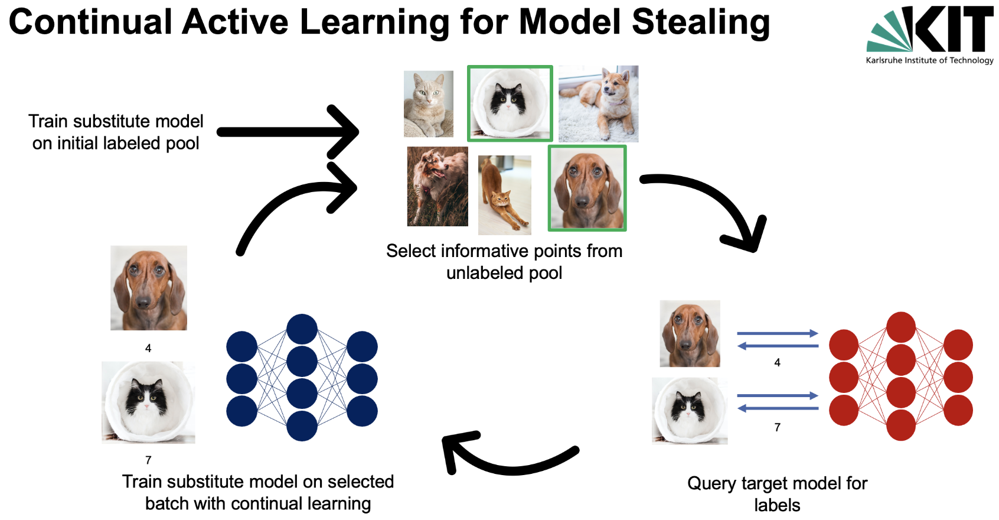

# Continual Active Learning for Effective Model Stealing attacks



## Abstract
 The rising popularity of Machine Learning as a Service (MLaaS) has seen an increasing amount of machine learning models exposed to the public via prediction APIs. Users of prediction APIs query an image to the API and receive the prediction outcome, either a class label or prediction probabilities of the model behind the API, as a response. In the past, numerous research papers have demonstrated that it is possible to train a local clone of the model behind the API via malicious queries and named this field model stealing. Within model stealing, researchers have had remarkable success with model stealing attacks using active learning. In this thesis, I proposed a novel approach named continual active learning. Continual active learning combines active learning and continual learning aiming to decrease the resource intensity of active learning while maintaining or surpassing its performance. First, I benchmarked the performance of continual active learning compared with active learning, achieving a reduction in execution time of 60-98% at a performance decrease of 10-30%. Afterward, I applied continual active learning to perform model stealing attacks but failed to outperform other approaches relying on active learning.

## Project overview
- bin: Contains shell-scripts used to run experiments on [BwUniCluster2.0](https://wiki.bwhpc.de/e/BwUniCluster2.0/Login), The HPC Cluster of the State of Baden-Württemberg
- doc: Contains the LaTeX-code of the Thesis Report and the Exposé that was created as a plan for the contents of the Thesis
- experiments: Contains logs of the results of all experiments
- src: Contains the actual source code as well as all config files

## Installation
First, install the requirements listed in the `requirements.txt`` file.
To get the SmallImageNet dataset, please run the following line first from the base directory (i.e. 'calms')

```console
python src/utils/prepare_dataset.py --dataset SmallImageNet --resolution 32 --data-dir data --download-dir data/compressed
``````

## Code
To run the experiments with a given config file and learning mode run the following line in your terminal
```console
python src/main.py -c path-to-your-config-file.yaml -m selected-mode
```
For information on the command line arguements run
```console
python src/main.py --help
```
## Documentation
There code itself is documented. For documentation regarding the thesis, please have a look at the `thesis.pdf`` file in the main directory. If you want to build it from source, run the file `doc/thesis/thesis.tex` with the latex compiler of your choice.
